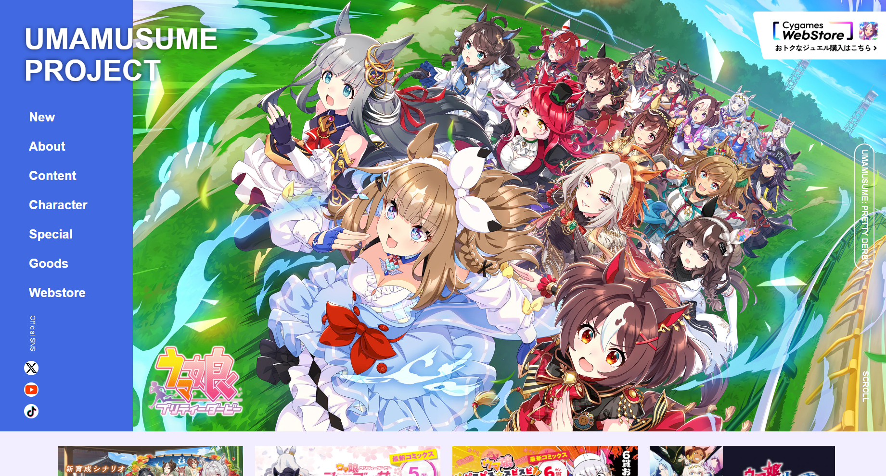
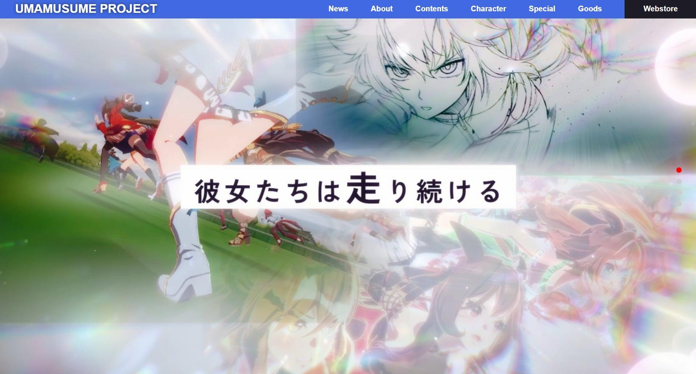
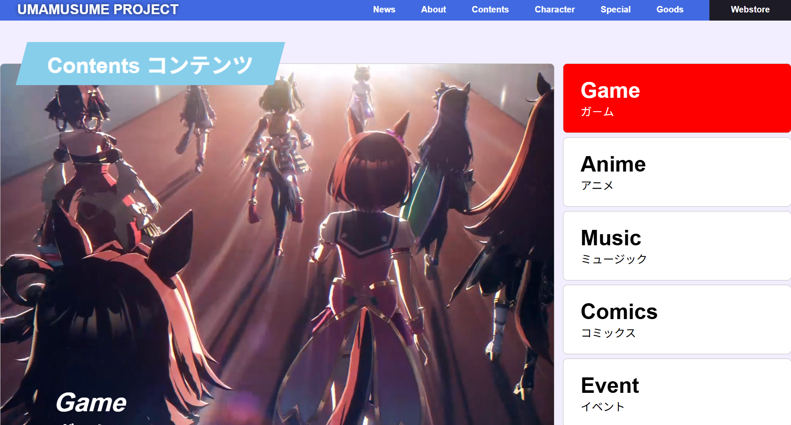
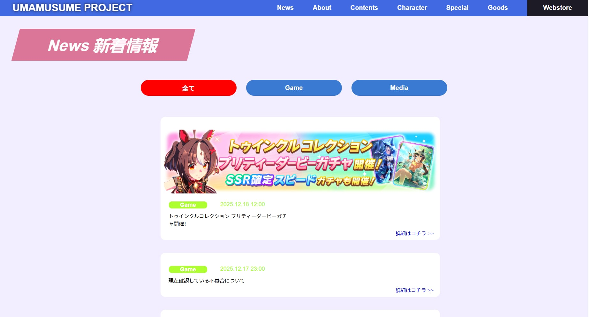

# Game Website Practice
A practice project for building a game-themed website layout using HTML, CSS, and JavaScript.
โปรเจกต์ฝึกสร้างเว็บไซต์ธีมเกม เพื่อฝึกการทำ layout และโครงสร้างเว็บไซต์ด้วย HTML, CSS และ JavaScript

## 🌐 Demo
👉 https://pphetto.github.io/game-website-practice/

## 🛠 Tech Stack
- HTML5
- CSS3
- JavaScript (Vanilla)

## ✨ Features
- Multi-page website structure
- Navigation menu
- Character / Content pages
- Static website (no backend)

## 📸 Screenshots
# Home Page

# About Page

# Content Page

# News Page

## 🚀 How to Run Locally
Just open `index.html` in your browser.
หรือใช้ Live Server ใน VS Code

## 📌 Notes
This project was created for learning purposes and portfolio practice.
โปรเจกต์นี้จัดทำขึ้นเพื่อฝึกฝนและใช้เป็นผลงานใน Portfolio